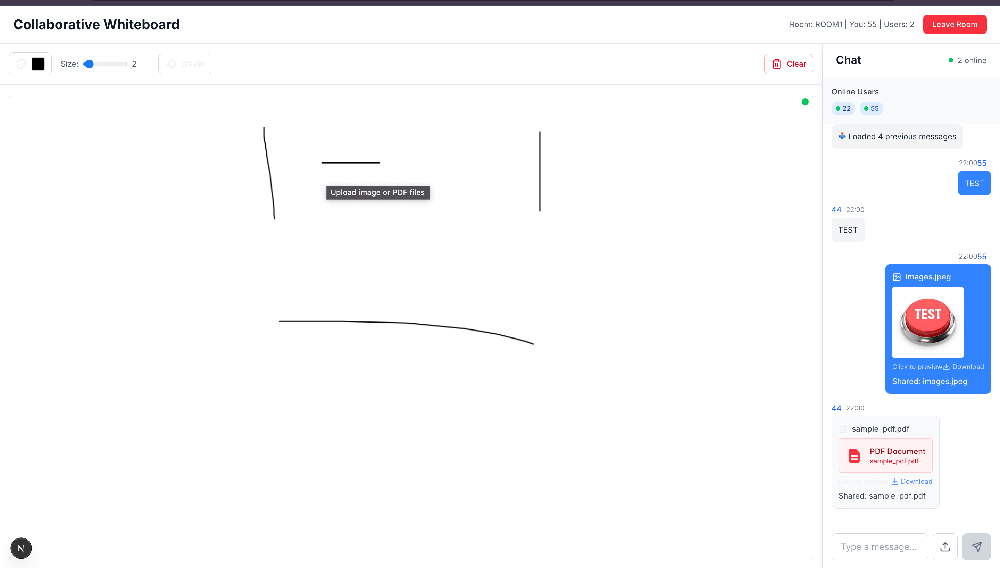
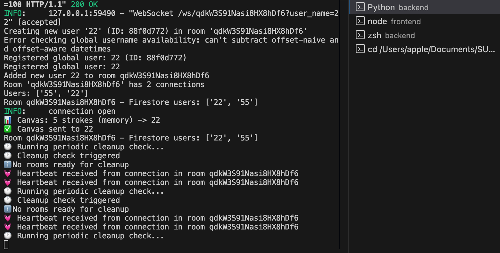
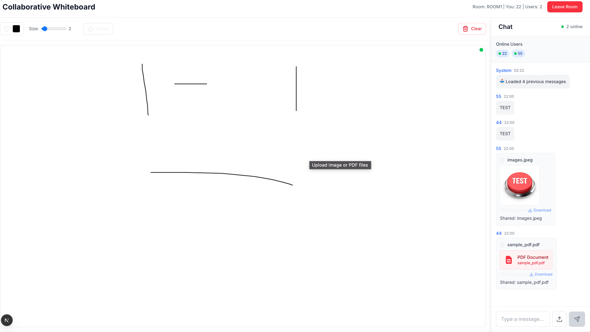

# Collaborative Whiteboard Frontend

A modern, real-time collaborative whiteboard application built with Next.js, TypeScript, and WebSocket technology.



## Features

- **Real-time Collaboration**: Multiple users can draw simultaneously on the same canvas
- **Live Chat**: Built-in chat system with file sharing capabilities
- **Room Management**: Create and join rooms with custom names
- **User Management**: Unique usernames with global availability checking
- **File Sharing**: Upload and share images and PDFs
- **Responsive Design**: Works on desktop and mobile devices

## Tech Stack

- **Framework**: Next.js 14 with App Router
- **Language**: TypeScript
- **Styling**: Tailwind CSS
- **Real-time**: WebSocket connections
- **File Upload**: Native browser APIs
- **State Management**: React hooks and context



## Quick Start

### Prerequisites

- Node.js 18+ 
- npm or yarn

### Installation

1. **Clone the repository**
   ```bash
   git clone <repository-url>
   cd collaborative-app/frontend
   ```

2. **Install dependencies**
   ```bash
   npm install
   # or
   yarn install
   ```

3. **Set up environment variables**
   ```bash
   cp env.example .env.local
   ```
   
   Configure the following variables:
   ```env
   NEXT_PUBLIC_BACKEND_URL=http://localhost:8000
   NEXT_PUBLIC_CHAT_MESSAGE_LIMIT=100
   NEXT_PUBLIC_WS_RECONNECT_DELAY=1000
   NEXT_PUBLIC_WS_MAX_RECONNECT_ATTEMPTS=5
   NEXT_PUBLIC_WS_HEARTBEAT_INTERVAL=30000
   NEXT_PUBLIC_DUPLICATE_DETECTION_WINDOW=2000
   ```

4. **Start the development server**
   ```bash
   npm run dev
   # or
   yarn dev
   ```

5. **Open your browser**
   Navigate to [http://localhost:3000](http://localhost:3000)

## Usage

### Getting Started

1. **Enter a username** - Choose a unique username for your session
2. **Create or join a room** - Either create a new room or join an existing one
3. **Start collaborating** - Draw on the canvas and chat with other users

### Features Overview



#### Drawing Tools
- **Freehand Drawing**: Click and drag to draw
- **Multiple Colors**: Choose from a color palette
- **Brush Sizes**: Adjust stroke thickness
- **Real-time Sync**: See other users' drawings instantly

#### Chat System
- **Text Messages**: Send and receive text messages
- **File Sharing**: Upload images and PDFs
- **Message History**: View previous messages when joining a room
- **User Status**: See who's online in the room

#### Room Management
- **Room Creation**: Create rooms with custom names
- **Room Joining**: Join existing rooms by name
- **User Tracking**: See all users currently in the room
- **Auto-cleanup**: Rooms are automatically cleaned up when empty

## Project Structure

```
frontend/
├── public/                 # Static assets
│   ├── user1.png          # Main interface screenshot
│   ├── user2.png          # Collaboration screenshot
│   └── *.svg              # Icons and logos
├── src/
│   ├── app/               # Next.js App Router
│   │   ├── layout.tsx     # Root layout
│   │   ├── page.tsx       # Main application page
│   │   └── globals.css    # Global styles
│   ├── components/        # React components
│   │   ├── Chat.tsx       # Chat interface
│   │   ├── CreateRoom.tsx # Room creation form
│   │   ├── FilePreviewModal.tsx # File preview modal
│   │   ├── RoomList.tsx   # Room listing
│   │   ├── UserNameEntry.tsx # Username input
│   │   └── Whiteboard.tsx # Drawing canvas
│   └── utils/
│       └── websocket.ts   # WebSocket management
├── env.example            # Environment variables template
├── next.config.ts         # Next.js configuration
├── package.json           # Dependencies and scripts
├── tailwind.config.js     # Tailwind CSS configuration
└── tsconfig.json          # TypeScript configuration
```

## Environment Variables

| Variable | Description | Default |
|----------|-------------|---------|
| `NEXT_PUBLIC_BACKEND_URL` | Backend API URL | `http://localhost:8000` |
| `NEXT_PUBLIC_CHAT_MESSAGE_LIMIT` | Max messages to load | `100` |
| `NEXT_PUBLIC_WS_RECONNECT_DELAY` | WebSocket reconnect delay (ms) | `1000` |
| `NEXT_PUBLIC_WS_MAX_RECONNECT_ATTEMPTS` | Max reconnect attempts | `5` |
| `NEXT_PUBLIC_WS_HEARTBEAT_INTERVAL` | Heartbeat interval (ms) | `30000` |
| `NEXT_PUBLIC_DUPLICATE_DETECTION_WINDOW` | Duplicate detection window (ms) | `2000` |

## Development

### Available Scripts

```bash
npm run dev          # Start development server
npm run build        # Build for production
npm run start        # Start production server
npm run lint         # Run ESLint
npm run type-check   # Run TypeScript type checking
```

### Key Components

- **WebSocketManager**: Handles real-time communication with the backend
- **Whiteboard**: Canvas component for drawing functionality
- **Chat**: Real-time messaging interface
- **RoomList**: Room management and navigation

## Deployment

The frontend is designed to be deployed on Vercel or any static hosting platform.

### Vercel Deployment

1. Connect your repository to Vercel
2. Set environment variables in Vercel dashboard
3. Deploy automatically on push to main branch

### Manual Deployment

```bash
npm run build
npm run start
```

## Contributing

1. Fork the repository
2. Create a feature branch
3. Make your changes
4. Test thoroughly
5. Submit a pull request

## License

This project is part of a collaborative whiteboard application. See the main repository for license information.